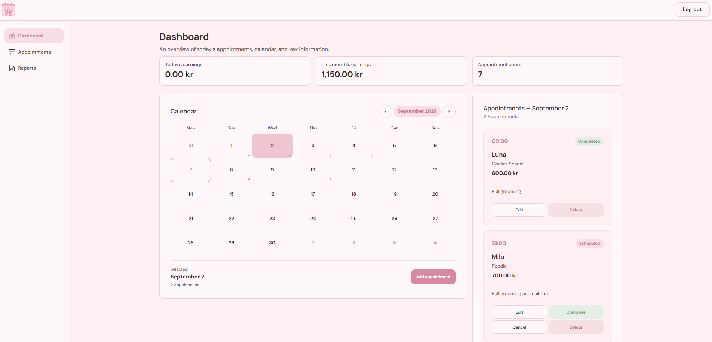

# 🐾 DogCalendar

A responsive appointment-management **PWA** for a dog groomer — built with React, TypeScript, and Supabase.

DogCalendar helps a dog groomer track daily appointments, reuse client/dog profiles, see earnings at a glance, and export monthly PDF reports — installable on a phone like a native app.





<!--  -->

---

## ✨ Features

- **Dashboard** — today's earnings, this month's earnings, a mini calendar, and the day's appointments at a glance.
- **Appointments** — create, edit, cancel, complete, or delete appointments, with a separate Upcoming/History view.
- **Saved Dogs** — reusable client profiles (name, breed, phone number) with autocomplete when booking a new appointment, so repeat customers never have to be retyped from scratch.
- **Smart syncing** — editing a Saved Dog's details can update matching upcoming appointments, and vice versa, while keeping historical appointment data intact.
- **Monthly PDF reports** — generate a polished, paginated PDF of any month's appointments and earnings, entirely in the browser.
- **Guest demo mode** — a one-click "Continue as Guest" login that spins up a temporary account pre-filled with realistic sample data, so anyone can try the app with nothing to sign up for.
- **Installable PWA** — add it to your phone's home screen, with offline asset caching and an in-app update prompt.
- **Per-user data isolation** — enforced at the database level with PostgreSQL Row Level Security, not just in the frontend.

---

## 🛠 Tech stack

| Layer | Technology |
|---|---|
| UI | React 19 + TypeScript |
| Build tool | Vite |
| Routing | React Router |
| Backend | Supabase (PostgreSQL + Auth) |
| Styling | Plain CSS (custom properties, BEM-style naming, mobile-first) |
| PDF export | jsPDF |
| PWA / offline | vite-plugin-pwa (Workbox) |
| Testing | Vitest + React Testing Library |
| Hosting | Vercel |

---

## 🏗 Architecture

The app follows a simple, layered flow — every piece of data goes through the same path, whether it's read or written:

```text
Pages            → one component per route (Dashboard, Appointments, Reports)
  ↓
Feature components → the actual UI for one feature (calendar grid, appointment list, forms)
  ↓
Hooks            → shared state + mutations (useAppointmentManager, useSavedDogs, useAuth)
  ↓
Services         → the only code that talks to Supabase
  ↓
Supabase client  → sends requests to the Supabase API
  ↓
PostgreSQL + RLS → the real authorization boundary
```

**Authorization lives in the database, not the frontend.** Every table (`appointments`, `saved_dogs`) has Row Level Security policies that restrict every read/write to the authenticated user's own rows. Route guards and UI checks are there for good UX — they are not what keeps one user's data private from another's.

For the full breakdown, see [`docs/ARCHITECTURE.md`](./docs/ARCHITECTURE.md), [`docs/DATABASE.md`](./docs/DATABASE.md), and [`docs/SECURITY.md`](./docs/SECURITY.md).

### Project structure

```text
src/
├── components/     Shared, app-wide UI (auth guard, layout shell, modal, toast, PWA prompt)
├── features/       UI that belongs to one feature area (appointments, dashboard, savedDogs)
├── hooks/          Reusable state + behavior (useAuth, useAppointmentManager, useSavedDogs)
├── pages/          One component per route (Login, AppHome, AppointmentsPage, Reports)
├── services/       Functions that call Supabase (auth, appointments, savedDogs)
├── types/          Shared TypeScript interfaces (Appointment, SavedDog)
├── utils/          Pure functions (calendar math, currency formatting, PDF generation)
└── styles/         Global CSS variables and resets

docs/
├── VISION.md         Product purpose and direction
├── ARCHITECTURE.md   Technical shape of the codebase
├── DATABASE.md        Schema, relationships, RLS requirements
├── SECURITY.md        Security model and review history
├── UI-UX.md           Navigation and interaction rules
├── ROADMAP.md         Stage-by-stage plan and status
├── AI-CONTEXT.md      Fast-loading project context
└── stages/            One spec per development stage (01–09)
```

---


## 📜 Available scripts

| Command | What it does |
|---|---|
| `npm run dev` | Starts the local dev server with hot reload |
| `npm run build` | Type-checks the project, then builds an optimized production bundle |
| `npm run preview` | Serves the production build locally, for a final sanity check |
| `npm run lint` | Runs ESLint |
| `npm run test` | Runs the test suite in watch mode |
| `npm run test:run` | Runs the test suite once (used in CI) |

---

## ✅ Testing

The project has a Vitest + React Testing Library suite covering the pure utility functions, the Supabase-backed services (with Supabase mocked), the shared hooks, and key components. Run it with:

```bash
npm run test:run
```

Tests verify application logic in isolation — actual cross-user data isolation is verified separately, directly against the real database, since that's what Row Level Security policies are for. See [`tests/README.md`](./tests/README.md) for details.

---

## 🔐 Security

- Every table is protected by PostgreSQL Row Level Security — a user can only ever read or write their own data, enforced by the database itself.
- Only the public Supabase anon key ever ships to the browser; the service role key never appears in frontend code.
- Deployment headers (`vercel.json`) set `X-Content-Type-Options`, `X-Frame-Options`, `Referrer-Policy`, and a restrictive `Permissions-Policy`.
- No `dangerouslySetInnerHTML`, `eval()`, or custom auth/JWT handling anywhere in the codebase.

Full details and review history: [`docs/SECURITY.md`](./docs/SECURITY.md).

---

## 📦 Deployment

The app is set up to deploy on [Vercel](https://vercel.com/). `vercel.json` includes the SPA rewrite rule (so client-side routing survives a page refresh) and the security headers above. Remember to set `VITE_SUPABASE_URL` and `VITE_SUPABASE_ANON_KEY` as environment variables in your Vercel project settings.

---

## 📚 Documentation

| Doc | Covers |
|---|---|
| [`docs/VISION.md`](./docs/VISION.md) | Why this project exists, and what it should (and shouldn't) become |
| [`docs/ARCHITECTURE.md`](./docs/ARCHITECTURE.md) | The layered architecture and folder structure |
| [`docs/DATABASE.md`](./docs/DATABASE.md) | Schema, the Appointment ↔ Saved Dog relationship, RLS requirements |
| [`docs/SECURITY.md`](./docs/SECURITY.md) | The security model and review history |
| [`docs/UI-UX.md`](./docs/UI-UX.md) | Navigation and interaction decisions |
| [`docs/ROADMAP.md`](./docs/ROADMAP.md) | Stage-by-stage plan and definition of done |
| [`docs/AI-CONTEXT.md`](./docs/AI-CONTEXT.md) | Condensed project context and important rules |
| [`docs/stages/`](./docs/stages/) | One detailed spec per development stage |

---

## 🗺 Project status

| Stage | Status |
|---|---|
| 01 — Project Foundation | ✅ Complete |
| 02 — Authentication & Authorization | ✅ Complete |
| 03 — Appointments | ✅ Complete |
| 04 — Calendar | ✅ Complete |
| 05 — Dashboard | ✅ Complete |
| 06 — UI/UX Refinement | ✅ Complete |
| 07 — PWA | ✅ Complete |
| 08 — Monthly PDF Reports | ✅ Complete |
| 09 — Saved Dogs & Appointment History | ✅ Complete |

**Deliberately out of scope:** appointment search/filtering (dog-name search, breed search, date/status filters) was evaluated during Stage 09 and consciously left out of the current scope rather than partially built.

---

## Author

**Wiktor Okonski**

Frontend Developer

* LinkedIn: [https://www.linkedin.com/in/wiktor-okonski-76778233/](https://www.linkedin.com/in/wiktor-okonski-76778233b/)
* Portfolio: [wiktor-portfolio.vercel.app](https://wiktor-portfolio.vercel.app/)